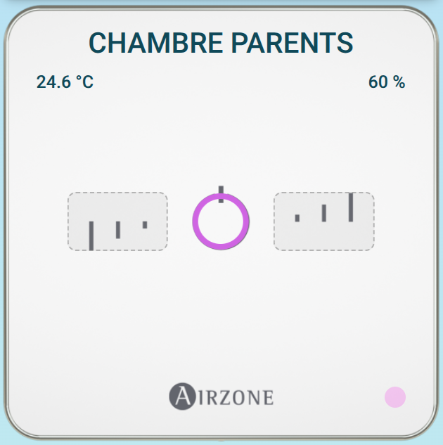
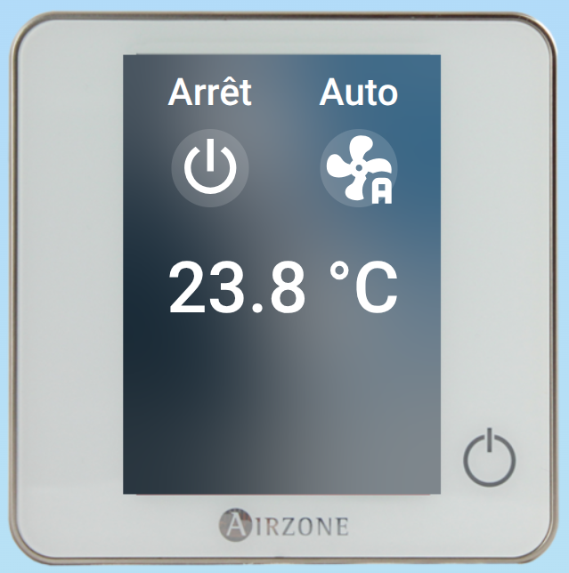

# Airzone Thermostat Card

Carte personnalisée pour [Home Assistant](https://www.home-assistant.io/) permettant d'afficher et de contrôler les thermostats **Airzone Lite** et **Airzone Blueface**.

La carte est conçue pour fonctionner avec la bibliothèque Python **[airzone-modbus](https://github.com/exelsis423/airzone-modbus)**, qui assure la communication avec le système Airzone via Modbus TCP.

> ⚠️ **Projet personnel / expérimental**
>
> Cette carte a été développée pour mon installation Airzone et n'a pas été testée sur toutes les configurations possibles. Le fonctionnement peut donc varier selon le matériel, la version du système Airzone et la configuration de l'installation.

---

## Fonctionnalités

### Thermostat Airzone Lite

La carte permet d'afficher :

* le nom de la zone ;
* la température de la zone ;
* l'humidité ;
* l'offset de température du thermostat ;
* l'état de la LED du thermostat ;
* l'état de la zone.

L'anneau central indique visuellement l'état du système :

| Mode machine    | Couleur   |
| --------------- | --------- |
| Arrêt           | 🟣 Violet |
| Refroidissement | 🔵 Bleu   |
| Ventilation     | 🔵 Bleu   |
| Chauffage       | 🔴 Rouge  |

Le comportement de l'anneau dépend également de l'état de la zone :

* **zone active** → anneau fixe ;
* **zone arrêtée** → anneau clignotant.

La couleur et le clignotement sont donc indépendants :

* la **couleur** dépend du mode de fonctionnement de la machine ;
* le **clignotement** dépend de l'état de la zone.

Les flèches autour de l'anneau permettent de modifier directement l'offset du thermostat de **-3 à +3 °C**.

Les températures et l'humidité sont également cliquables et ouvrent la fenêtre *More Info* de Home Assistant.

---

### Thermostat Airzone Blueface

La version Blueface affiche :

* la température de la zone ;
* le mode de fonctionnement de la machine ;
* la vitesse de ventilation.

Les commandes sont directement accessibles depuis la carte.

Un clic sur le mode permet de sélectionner :

* Arrêt ;
* Froid ;
* Chaud ;
* Ventilation.

Un clic sur la vitesse permet de sélectionner :

* Automatique ;
* Lent ;
* Faible ;
* Rapide.

La sélection est effectuée directement via les entités `select` de Home Assistant.

---

# Installation

## Avec HACS

La carte peut être installée comme ressource frontend via HACS.

Ajouter le dépôt comme dépôt personnalisé si nécessaire :

```text
https://github.com/exelsis423/airzone-modbus-ha-card
```

Type :

```text
Dashboard
```

Après installation, ajouter la ressource JavaScript fournie par la carte.

---

## Installation manuelle

Télécharger le fichier JavaScript depuis le dossier `dist` du dépôt :

https://github.com/exelsis423/airzone-modbus-ha-card

Puis placer le fichier dans le dossier `/config/www/`.

Ajouter ensuite la ressource dans Home Assistant :

```yaml
url: /local/airzone-thermostat-card.js
type: module
```

Selon le nom du fichier présent dans la version installée, adapter le chemin si nécessaire.

---

# Configuration

La carte se configure directement dans le dashboard Lovelace.

Exemple minimal :

```yaml
type: custom:airzone-thermostat-card
zone: 1
```

Par défaut, le type de thermostat est `lite`.

---

## Options disponibles

| Option       | Obligatoire | Valeurs             | Description                           |
| ------------ | ----------- | ------------------- | ------------------------------------- |
| `zone`       | Oui         | `1` à `16`          | Numéro de la zone Airzone             |
| `thermostat` | Non         | `lite` / `blueface` | Type de thermostat à afficher         |
| `name`       | Non         | texte               | Nom personnalisé affiché sur la carte |

---

## `zone`

Numéro de la zone Airzone à afficher.

Exemple :

```yaml
type: custom:airzone-thermostat-card
zone: 1
```

La carte utilise automatiquement les entités correspondant à cette zone.

Par exemple, pour la zone `1` :

```text
sensor.airzone_zone_1_nom
sensor.airzone_zone_1_temperature_sonde
sensor.airzone_zone_1_humidite
number.airzone_zone_1_offset_thermostat
switch.airzone_zone_1_led_thermostat
switch.airzone_zone_1_etat
```

Pour la zone `4`, les mêmes entités seront recherchées avec `_4_`.

---

## `thermostat`

Permet de choisir le type de thermostat représenté.

Valeurs possibles :

```yaml
thermostat: lite
```

ou :

```yaml
thermostat: blueface
```

Si cette option n'est pas renseignée, la valeur par défaut est :

```yaml
thermostat: lite
```

### Exemple Lite

```yaml
type: custom:airzone-thermostat-card
zone: 1
thermostat: lite
```

### Exemple Blueface

```yaml
type: custom:airzone-thermostat-card
zone: 1
thermostat: blueface
```

---

## `name`

Permet de remplacer le nom de la zone fourni par Airzone.

Sans `name`, la carte utilise automatiquement :

```text
sensor.airzone_zone_X_nom
```

Par exemple :

```yaml
type: custom:airzone-thermostat-card
zone: 1
```

Si le nom Airzone de la zone est `Salon`, la carte affichera :

```text
Salon
```

Il est possible de remplacer ce nom avec :

```yaml
type: custom:airzone-thermostat-card
zone: 1
name: Séjour
```

La carte affichera alors :

```text
Séjour
```

Le paramètre `name` est donc particulièrement pratique lorsque le nom enregistré dans le système Airzone ne correspond pas au nom souhaité dans Home Assistant.

---

# Exemples complets

## Thermostat Lite

```yaml
type: custom:airzone-thermostat-card
zone: 1
thermostat: lite
```

## Thermostat Lite avec nom personnalisé

```yaml
type: custom:airzone-thermostat-card
zone: 1
thermostat: lite
name: Salon
```

## Thermostat Blueface

```yaml
type: custom:airzone-thermostat-card
zone: 2
thermostat: blueface
```

## Plusieurs zones

Il est possible d'utiliser plusieurs cartes dans un même dashboard :

```yaml
type: vertical-stack
cards:

  - type: custom:airzone-thermostat-card
    zone: 1
    name: Salon

  - type: custom:airzone-thermostat-card
    zone: 2
    name: Chambre

  - type: custom:airzone-thermostat-card
    zone: 3
    thermostat: blueface
```

---

# Dépendance : airzone-modbus

Cette carte fait partie d'un projet plus large autour du contrôle des systèmes Airzone via Modbus TCP.

La bibliothèque Python utilisée pour communiquer avec le système Airzone est disponible ici :

**https://github.com/exelsis423/airzone-modbus**

Elle permet notamment de lire et modifier :

* l'état des zones ;
* le mode des zones ;
* la consigne ;
* la température ;
* l'humidité ;
* le nom des zones ;
* l'offset des thermostats Lite ;
* la LED des thermostats Lite ;
* le mode de fonctionnement de la machine ;
* la vitesse de ventilation ;
* les zones présentes sur la machine.

La bibliothèque contient également la documentation des registres Modbus étudiés et utilisés pour ce projet.

La carte Home Assistant s'appuie sur les entités créées à partir de cette communication Modbus.

---

# Captures d'écran

### Thermostats Lite



### Thermostat Blueface



---

# Structure du projet

```text
airzone-modbus-ha-card/
├── dist/
│   └── airzone-thermostat-card.js
├── images/
│   ├── airzone-lite.png
│   └── airzone-blueface.png
├── hacs.json
└── README.md
```

---

# Compatibilité

Cette carte est développée spécifiquement pour les systèmes Airzone utilisant l'intégration Modbus développée dans le projet :

**[airzone-modbus](https://github.com/exelsis423/airzone-modbus)**

Elle n'utilise pas directement l'API Airzone Cloud.

Le fonctionnement dépend donc des entités exposées par l'intégration Home Assistant correspondante.

---

# Remarques

Le dimensionnement de la carte est volontairement basé sur la taille du conteneur. Les éléments graphiques sont ainsi redimensionnés automatiquement lorsque la largeur de la carte change.

La carte utilise [Lit](https://lit.dev/) pour son rendu frontend.

Les icônes utilisées dans l'interface Blueface proviennent des icônes Material Design Icons disponibles dans Home Assistant.

---

# Licence

Projet personnel mis à disposition sur GitHub.

Voir les fichiers du dépôt pour les informations de licence applicables.
